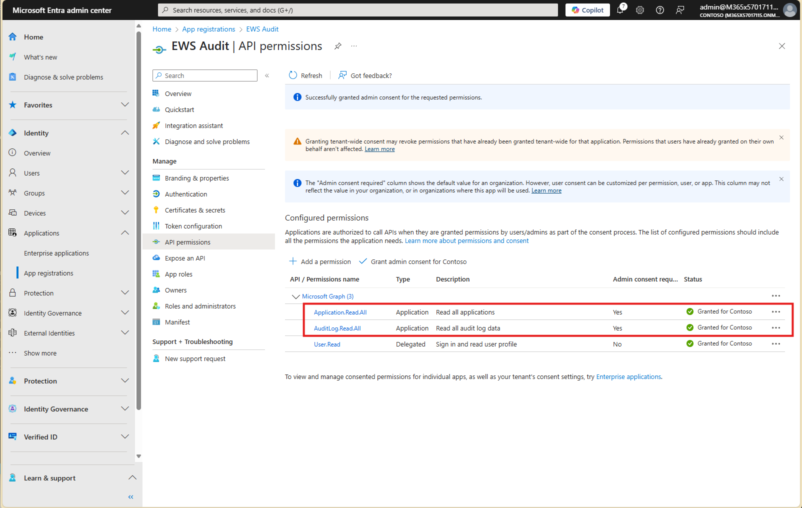
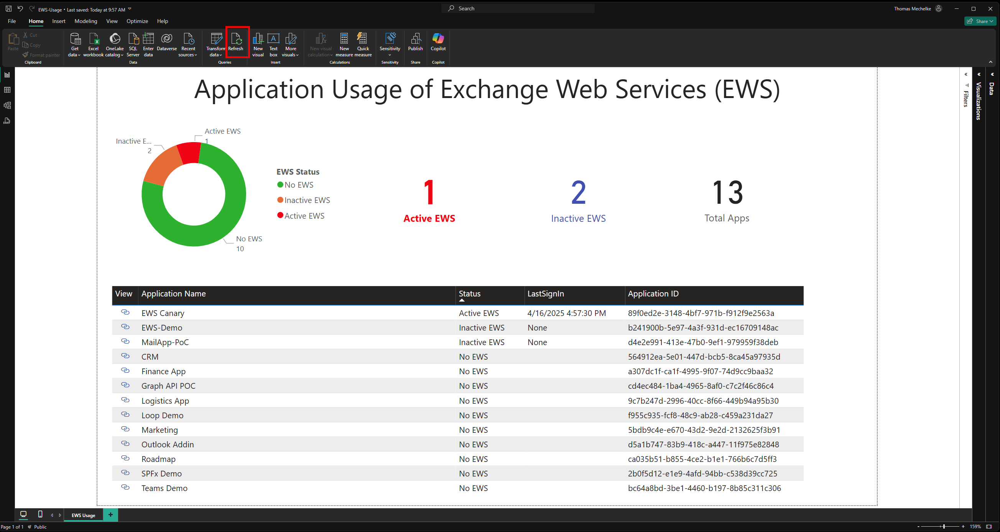

# Report Application Usage of Exchange Web Services (EWS)

## Overview

The first step in making a plan to migrate Exchange Web Services (EWS) applications to Microsoft Graph is to understand the current usage of EWS in your organization. This tool helps you collect and analyze EWS application usage data.

## Setup

### Create or Reuse an App Registration

There tool relies on Graph APIs to retrieve Application registrations and their permissions. It also queries the signin Audit log to identify applications that had recent activity. In order to run the queries, the tool needs its own app registration with following `Application` permissions:

- `AuditLog.Read.All`
- `Application.Read.All`

The API permissions should look like this:



It is recommended to create the client secret with a short expiration time that covers the time needed to run the investigation.

The notebook to collect the usage data is configured to use a Client Secret credential but the calls to `Scripts/Find-EwsUsage.ps1` can be modified to use different authentication methods.

### Update appSettings.json

Copy the Tenant ID, Application ID and Client Secret from the app registration you created or reused into the `appSettings.json` file. We recommend leaving the `OutputPath` settings because the Power BI report is configured to look for a data file there. The file should look like this:

```json
{
  "TenantId": "<tenant-id>",
  "ClientId": "<client-id>",
  "ClientSecret": "<client-secret>",
  "OutputPath": ".\\Usage-Data"
}
```

## Run the Reports

There are two parts to the report generation:

1. **Collect EWS usage data**: This is done by running the `Collect-EWS-App-Usage.ipynb` notebook. It will collect the EWS usage data and save it to the OutputPath specified in the `appSettings.json` file.

2. **Generate the reports**: This is done by running the `Report-EWS-App-Usage.ipynb` notebook. It will read the data collected in the previous step aggregate it and display the results within the notebook and update the `EWS-Usage.csv` file used by the Power BI report `EWS-Usage.pbix`.

> Note: The script used to download the application and audit data in `Collect-EWS-App-Usage.ipynb` is `Scripts/Find-EwsUsage.ps1`. It can be run independently of the notebook and supports a number of different queries that are not used here. It was copied from Jim Martin's [Exchange Usage Reporting repo](https://aka.ms/ewsUsage). See the documentation there for more details on additional functionality.

To see the current data in Power BI, click the `Refresh` button in the command bar. The report will then refresh and show the current data.



> Note: The Power BI Report assumes that `EWSUsage.csv` is located in folder `Usage-Data`. If you have selected a different OutputPath, you need to copy the `EWSUsage.csv` file to the `Usage-Data` folder or change the path in the Power BI report.

To view the PowerBI report, you need to have PowerBI Desktop installed. You can download it from [here](https://powerbi.microsoft.com/en-us/desktop/).

## Next Steps

Once you understand which active applications are using EWS, you can work with your engineering teams to plan the migration to Microsoft Graph or another solution.

The [EWS Code Analyzer](../Ews.Code.Analyzer/README.md) can help engineers identify the EWS dependencies in their code and provide suggestions for how to migrate to Microsoft Graph.

The most up-to-date information about EWS Deprecation can be found [here](https://aka.ms/ews1pageGH).
