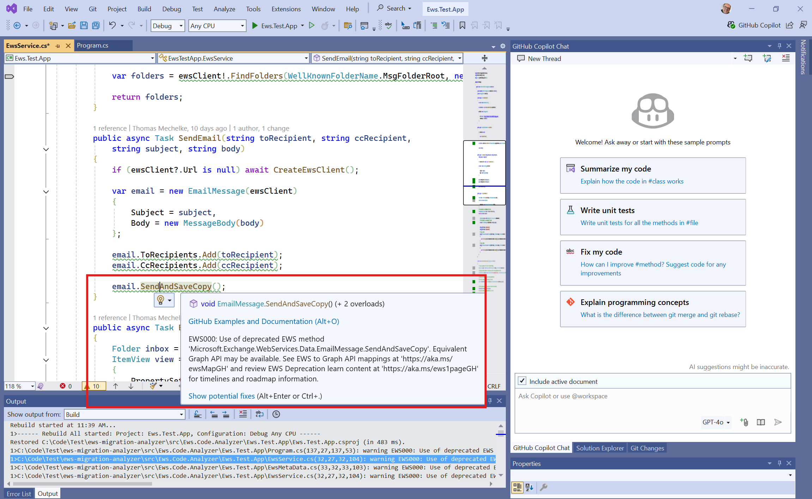
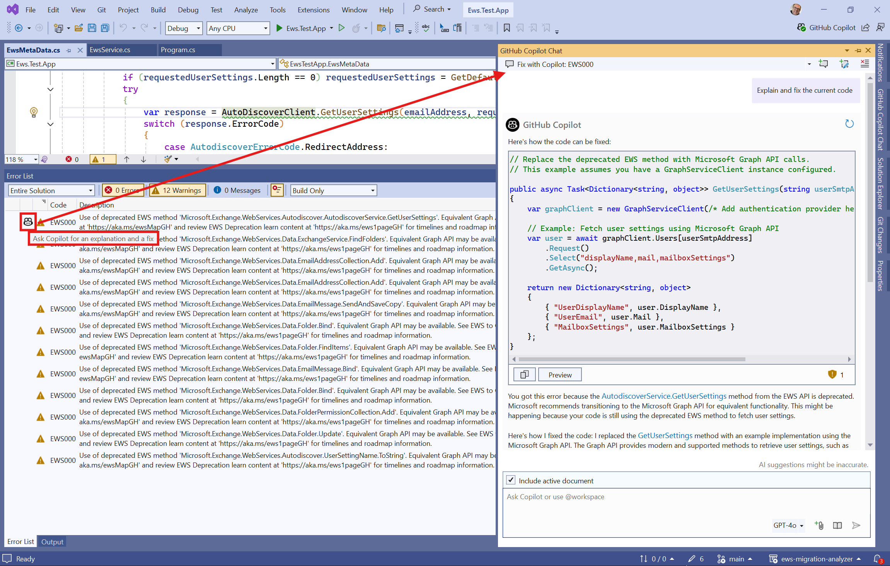
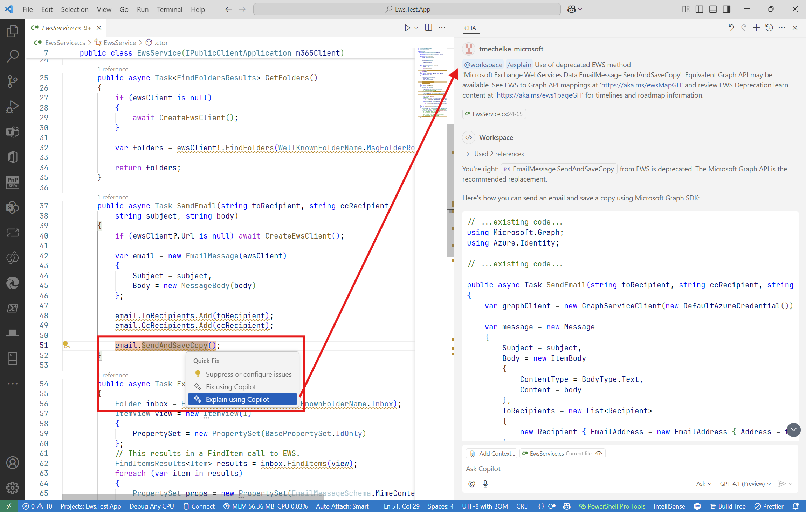
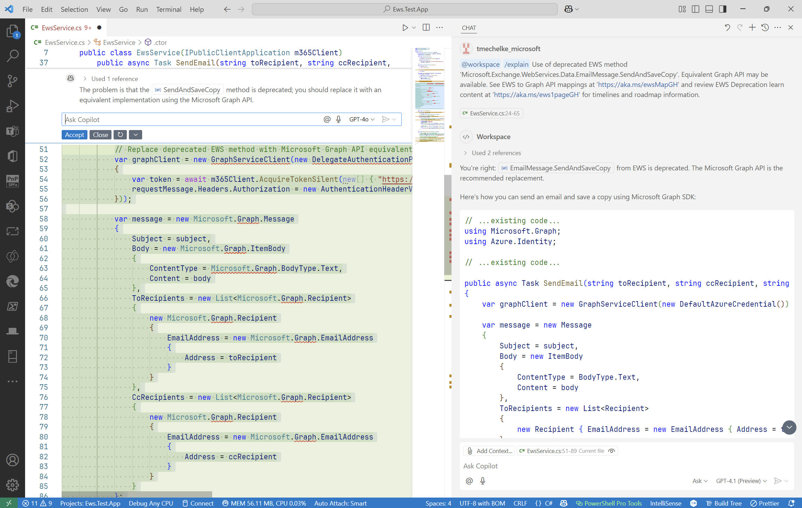

# EWS Code Analyzer

## Overview

The EWS Code Analyzer helps you identify EWS references in your code and get suggestions for the migration to equivalent Microsoft Graph APIs.

The easiest and most flexible way to use the EWS Code Analyzer is to install it as a NuGet package in your EWS application project.

## Building the EWS Analyzer Nuget Package

1. Create a local NuGet package source in Visual Studio (Tools > NuGet Package Manager > Package Manager Settings) and add a new Package Source with the path to the folder where you want to store the package, for example `C:\NugetPackages`. Alternatively, you can create the package source from the command line with `nuget sources add -Name LocalNuget -Source C:\NugetPackage`
1. Clone this repository to your local machine
1. Open the solution `src/Ews.Code.Analyzer/Ews.Analyzer.sln` in Visual Studio 2022
1. Select the build configuration (Debug or Release) and the target platform (x64 or x86) in the Visual Studio toolbar
1. Build the solution
1. Find the `Ews.Analyzer.Package` project in the solution explorer
1. Go to the ./bin/{configuration}/ folder of the project
1. Copy the `Ews.Analyzer.{version}.nupkg` file to the local NuGet package source folder you created in step 1

## Using the EWS Analyzer NuGet Package

### Installation

1. Open your EWS application project in Visual Studio 2022
1. Right-click on the project in the solution explorer and select "Manage NuGet Packages"
1. Select the "Browse" tab and select the local NuGet package source you created in the previous section
1. Search for "Ews.Analyzer" and install the package

If your solution has any references to EWS, the EWS Analyzer will automatically detect them and display them in the Error List window. The references in the code will also be highlighted in the code editor.

### Analyzer Messages

### Visual Studio

When hovering over a reference to EWS in the code editor, you will see a message indicating that the EWS is deprecated and suggests migration along with documentation links.

Clicking on the light bulb or the quick action menu (Ctrl + .) will show the available code fixes. In this version "Fix with Copilot" is the only option available if you have GitHub Copilot enabled. 

Selecting this option will utilize the references mentioned in the message to generate a new implementation using Microsoft Graph APIs if an alternative is available.

In a departure from the experience in Visual Studio Code, `Explain using Copilot` is not available from the quick action menu. Instead it can be accessed from the Error List window.

### Visual Studio Code

The experience in Visual Studio Code is similar to Visual Studio for the experiences in the editor window with the addition of the `Explain using Copilot` option being available from the quick action menu (Ctrl + .).

In many cases, GitHub Copilot will be able to generate a new implementation for a highlighted EWS reference.

## Advanced Uses of GitHub Copilot

EWS has been around for many years and application architectures have evolved. EWS Analyzer can give you a good idea about the location and distribution of EWS references in your code base and in many simple cases meaningfully accelerate the migration to Microsoft Graph APIs.

However, especially in older more complex codebases, the differences in usage patterns between EWS and Graph API for your application use case may require some refactoring prior to the migration.

Where possible, consider isolating the EWS code in separate libraries with a well defined interface and use dependency injection to select the implementation at runtime. GitHub Copilot in Edit or Agent mode can help with that process as well as building a suite of unit tests based on the interface (Edit and Agent mode are available in Visual Studio Code only at this time).

Once the application works again as expected, create (or let GitHub Copilot generate) an equivalent Graph API implementation of the same interface and ensure the unit tests pass with that implementation as well.

This puts you in a position where you can compare the behaviors and refine the Graph API implementation to match or improve on the EWS implementation and be well prepared for future growth in your application.

## Future Versions

We are investigating additional features like:

- Include parity roadmap information for EWS APIs that don't have a clear equivalent
- Improved code fixes that generate prompts for GitHub Copilot to generate alternative implementations at the method, class, project or codebase level.
- Sample migrations for common EWS usage patterns

Let us know what features you'd like to see by creating an issue in the [GitHub Repository](https://github.com/OfficeDev/ews-migration-analyzer/issues)