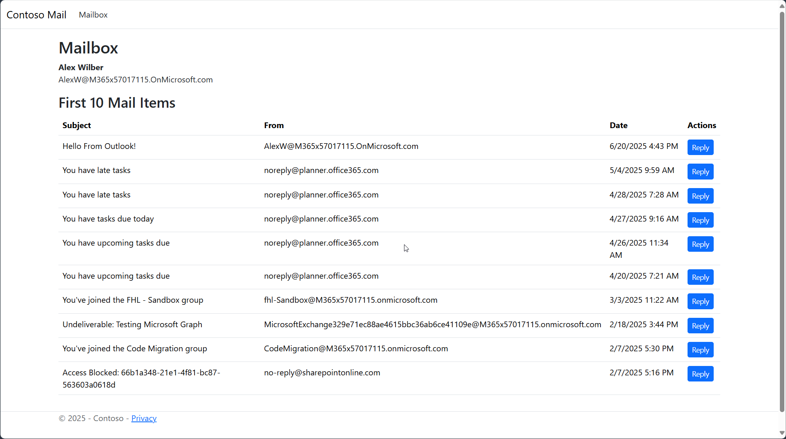
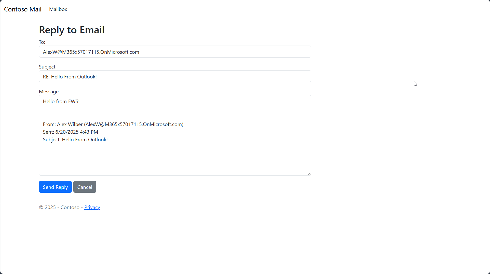
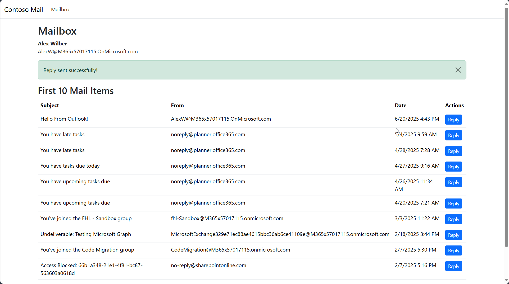

# 00-Baseline for Contoso Mail Sample Application

## Overview

In the real-world we are frequently faced with the challenge of modifying code we didn't write or have forgotten all about because it was written years ago. Oftentimes these applications were built quickly under time pressure and were shipped as soon as the passed the quality bar at the time. Especially successful apps didn't need to be updated for a long time. Many apps have no automated tests, no documentation and tribal knowledge about the code was lost over time.

This is a type of technical debt that accumulates over time and hampers the ability of organizations to quickly adapt to changing business needs, increases developer toil and frustration.

Most developers dread having to make changes to such applications, especially applications that send notifications that may support critical business processes.

In the era of vibe coding, the most underrated capability of tools like GitHub Copilot is their ability to analyze code, codify its current and desired design characteristics in a durable form, harden test suites and refactor code to improve security and maintainability. Using AI tools in this way, not only obliterates technical debt, but also sets up developers for success in future projects using the same workflows to create high quality, testable and observable code with minimal additional effort.

The sample application in this folder simulates such an application but it is simplified to be able to easily observe its end to end flow and focus on the AI based workflows that can be leveraged in many other scenarios.

It is a simple mail application built with ASP.NET MVC that uses Exchange Web Services (EWS) to view and reply to recent emails for an authenticated M365 user. It serves as the starting point for the migration.

The application displays the first 10 items of the M365 mailbox for the logged in user using EWS.

The user can reply to one of the emails, which will open a new window with a form to reply to the email.

The reply is sent using EWS.

Rather than relying purely on our own reading of the code, we'll utilize GitHub Copilot to help us understand the code better and codify our understanding and reduce technical debt every step of the way until we can confidently make the changes needed to migrate the application to Microsoft Graph API.
