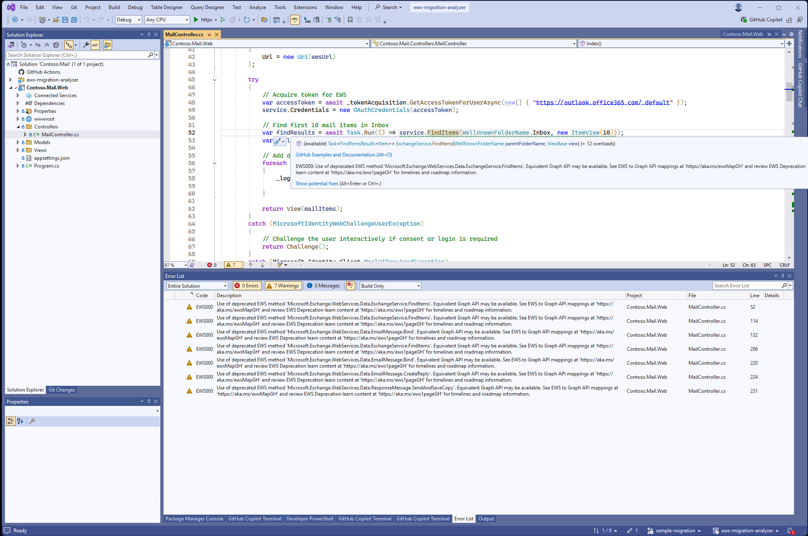
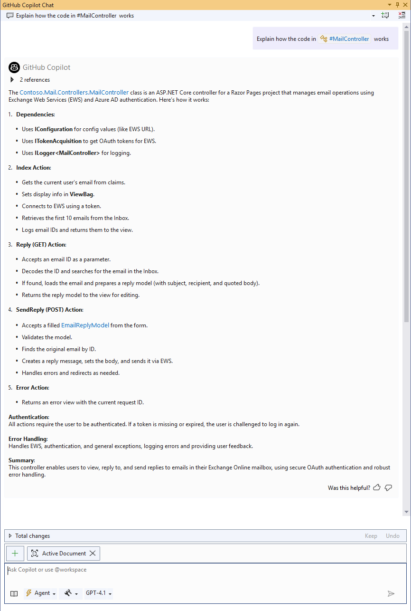
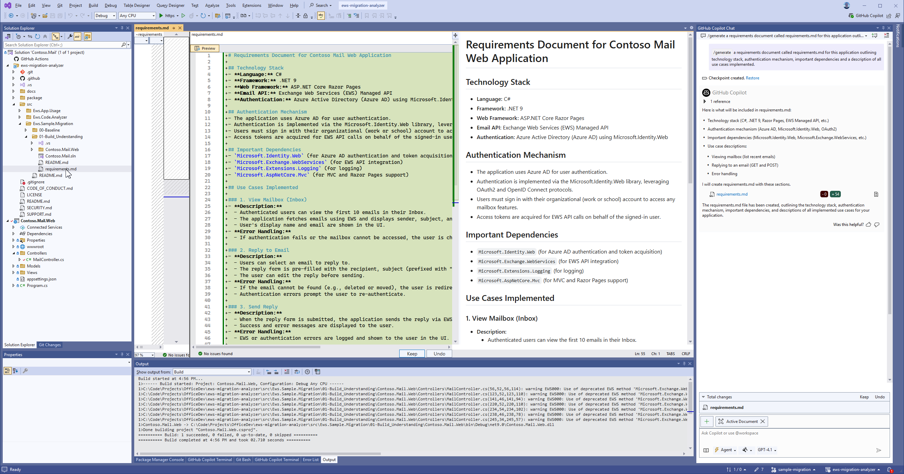
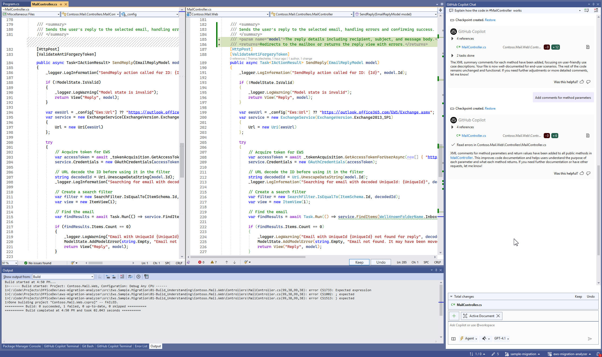
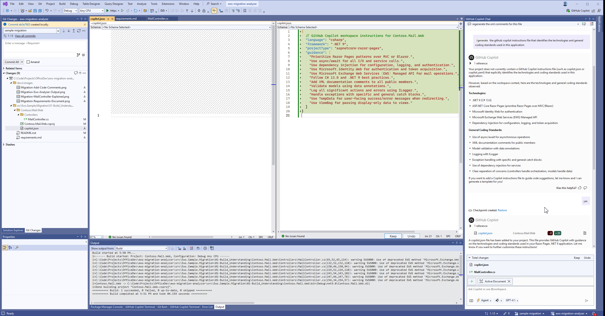

# 01-Build Knowledge About the Application

## Overview

This folder contains the changes to the baseline application that improve developer understanding of the code. This includes additional comments, tests and observability capabilities.

## Step-by-Step Guide

### Adding EWS Analyzer

The EWS Code Analyzer is a tool that helps identify and analyze the usage of Exchange Web Services (EWS) in your application. It's part of this repo as a compiled package and in source code to enable you to add code fixes for your environment and other features. For the purposes of this sample migration we'll use the existing capabilities to find all EWS references in our code.

To add the EWS Code Analyzer to your application, follow these steps:

1. Follow the instructions in [src/Ews.Code.Analyzer/README.md](../../Ews.Code.Analyzer/README.md) to build or find the EWS Code Analyzer NuGet package.
1. Add the Ews.Code.Analyzer package to the application project
1. Build the application project

Once the EWS Code Analyzer is added to the project, it will automatically analyze the code for references to EWS and provide insights into where and how EWS is used in the application.

The analyzer output shows that all references to EWS are concentrated in the `MailController.cs` file. As a best practice, we should consider refactoring the code to isolate EWS usage in a separate service or component. This will make it easier to replace EWS with Microsoft Graph API in one of the next steps.

### Building Context

One of the challenges with legacy applications is that they often lack documentation and comments, making it difficult to understand the code. To address this, we will collaborate with GitHub Copilot to generate explanations of the code and produce comments that describe the purpose and functionality of the code.

This step serves two purposes: first it helps us as the developer understand the code and its flow, and second it provides context for GitHub Copilot to generate more accurate code suggestions in future future. Reading the code in conjunction with the explanation provided by Copilot helps us build a mental model of the application and any areas of disagreement with our own observations and Copilot's suggestions.

The performance of GitHub Copilot and other AI coding tools is highly dependent on the amount of context provided for the task at hand. Too little or too much context can lead to suboptimal results.

GitHub Copilot tries to understand the context for your instructions based on several factors:

- Files manually added to the prompt
- Open files in the editor
- instructions.md files in the .github/copilot folder of your codebase
- Comments in the code
- Any hints like @workspace you add to your instructions

Every code base is different and Copilot's capabilities improve from week to week, so it's crucial to calibrate the relationship between our own understanding and how Copilot interprets the code at the time you are working with it. Embedding that shared understanding in the code comments will help us build tackle the migration in a more reliable way and maximize the value of Copilot's suggestions.

It's a good practice to commit the code after every successful step in the process to be able to revert back to a known good state and experiment with different instructions for Copilot.

#### Generate Documentation

To improve the understanding of the application logic and flow, we can use GitHub Copilot to generate code explanations and code comments.

As a first step we can have GitHub Copilot explain the code in the `MailController.cs` file. To do this, open the file in Visual Studio and open the GitHub Copilot chat window. Ask Copilot to explain the code in the file. It will generate a summary that describe the purpose and functionality of each method and property in the file.

The output is produced in markdown format which makes it easy to copy and paste to your documentation. Using this capability of Copilot, it's possible to recreate a list of use cases that are actually implemented in code which can then be used to create automated tests and help us validate the migration.

Now that we have a general idea of the code, let's take it one step further and generate a requirements document that describes the functionality of the application. This will help us understand the use cases that are implemented in the code and provide a reference for the migration.

We'll use prompt `/generate a requirements document called requirements.md for this application outlining technology stack, authentication mechanism, important dependencies and a description of all use cases implemented.` to start the process.

The [requirements document](../01-Build_Understanding/requirements.md) generated by Copilot provides a very good starting point for understanding the application and will serve as a guide for building out our tests and migration plan.

#### Generate Code Comments

To further aid understanding and to embed local context into the code, we can also ask Copilot to generate comments for the `MailService.cs` file. This file contains the logic for interacting with EWS, so having comments here will help us understand how the application retrieves and processes emails and embed useful context for the migration that Copilot can use to generate more accurate code suggestions as we refactor.

Open file `MailController.cs` and use prompt `/generate XML code comments for this file` to generate comments for the code. Copilot will generate comments that describe the purpose and functionality of each method and property in the file.

#### Generate GitHub Copilot Instructions

Let's also generate GitHub Copilot instructions to lock in the existing patterns and conventions used in the code base currently. We can tweak this file later on when we make changes to the structure and update conventions to the current ones used by our team.

Use prompt `/ generate the github copilot instructions file that identifies the technologies and general coding standards used in this application`

After confirming that we want Copilot to save the file to the solution folder, it produced [copilot.json](./Contoso.Mail.Web/copilot.json) in the project folder. This file contains the instructions that Copilot will use to generate code suggestions for this project in the future. Copilot instructions can exist and different levels in the repository. Keeping it scoped to the project level allows us to have different instructions for different project types and technologiles used in the solution.

This is a good time to commit the changes to the repository. We now have a better understanding of the code, a requirements document that describes the functionality of the application, and comments that explain the code logic. This will help us in the next steps of the migration process.

### UI Tests

### Observability

### Modularity

### GitHub Copilot Instructions

## Features Added

1. **EWS Analyzer**: Added EWS Analyzer to understand where and how EWS is used in the application.
1. **Code Comments**: Added comments to the code to improve understanding of the application logic and flow.
1. **UI Tests**: Added Playwright tests to ensure the application functions correctly and to catch regressions in the UI.
1. **Observability**: Integrated Aspire to provide better observability and insights into the application's performance and behavior.
1. **Modularity**: Refactored the code to improve modularity and maintainability, making it easier to understand and extend in the future.
1. **GitHub Copilot Instructions**: Added AI instructions to guide GitHub Copilot toward generating code that is aligned with coding guidelines and team conventions.

## Next Steps

1. Implement EWS components with Graph API