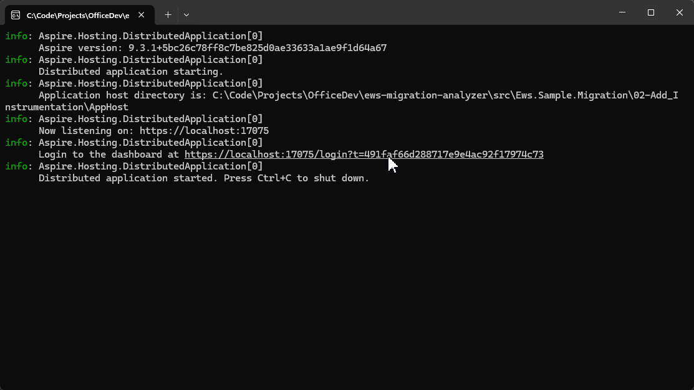
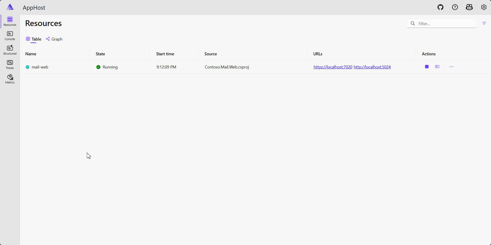
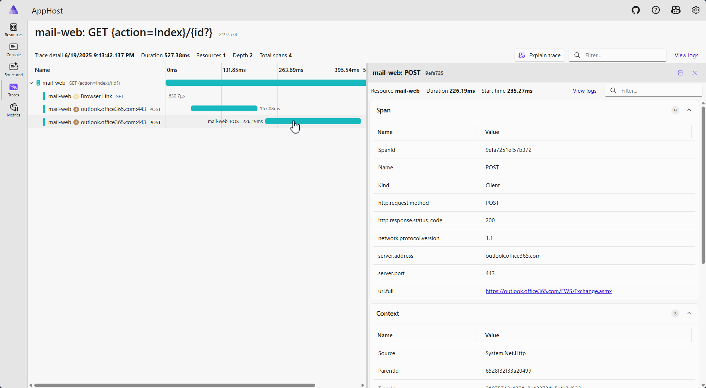
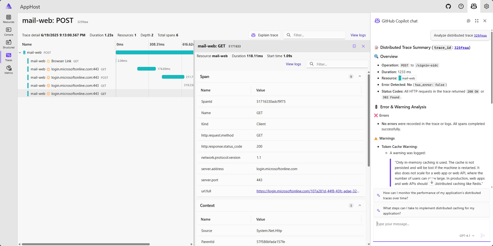
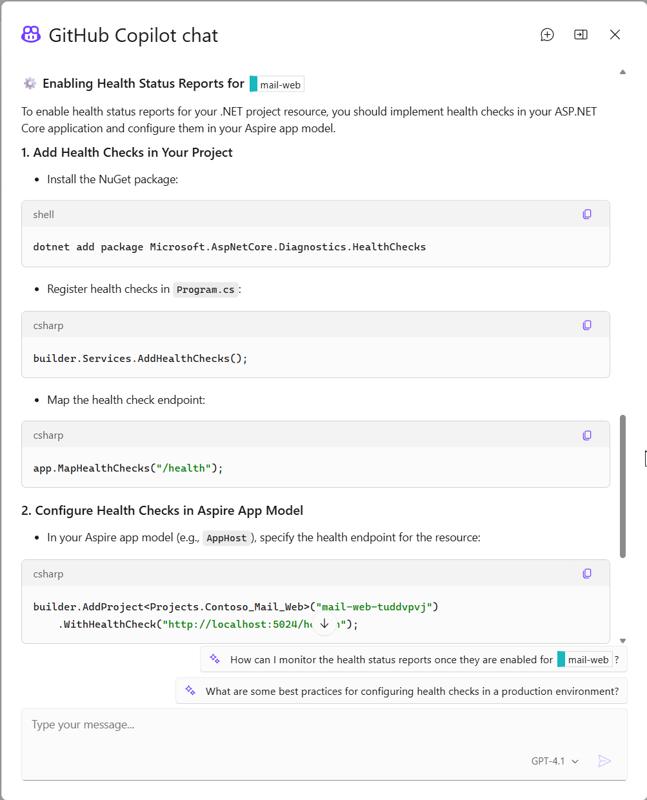

# 02-Add Instrumentation

## Overview

Now that we understand the code at a static level we can turn our attention to improving the observability of the application at runtime.

The solution in this folder adds instrumentation using Aspire and UI tests using Playwright to the Contoso Mail sample application. Aspire adds value even though this application is not very complex because it improves the inner loop for developers and observability of the application backend where all of the code and configuration changes will occur. Aspire also provides a smooth path to an improved deployment story and support for additional services if the application is extended now or in the future.

The other improvement we should make now before we start changing the code to replace EWS is to add automated tests to the application to ensure the user experience is not impacted by the changes and we detect any regressions as early as possible.

## Step-by-Step Guide

### Instrumentation with Aspire

Adding Aspire to the solution is easy to do:

1. Add new `Aspire ServiceDefaults` project to the solution
1. Add new `Aspire AppHost` project to the solution
1. In the `AppHost` project add a project reference to `Contoso.Mail.Web`
1. In `Contoso.Mail.Web` add a project reference to `ServiceDefaults`
1. In `Contoso.Mail.Web\Program.cs` after line 9 (`var builder = WebApplication.CreateBuilder(args);`) add `builder.AddServiceDefaults();`
1. In the `AppHost` project after line 1 add `var web builder.AddProject<Projects.Contoso_Mail_Web>("mail-web);`
1. Select `AppHost` as the startup project
1. Start the application (`F5`)

#### Launch

Starting the application will launch a command window. In the log there will be a link to the Aspire dashboard

When you open the link, the browser should bring up the Aspire dashboard and the `mail-web` application should be starting up or already be running.

From here you can launch the web site, view logs and traces and dig into metrics for your application.

In the most recent versions of Aspire (v0.9.2 and later) you can also access GitHub Copilot from the dashboard to help explain error messages and provide suggestions to improve observability and resilience for your application.

With that we are in a good position to understand and detect issues on the operational side of the application. Let's add tests and make sure we can make changes with the confidence that we are not breaking the existing functionality.
