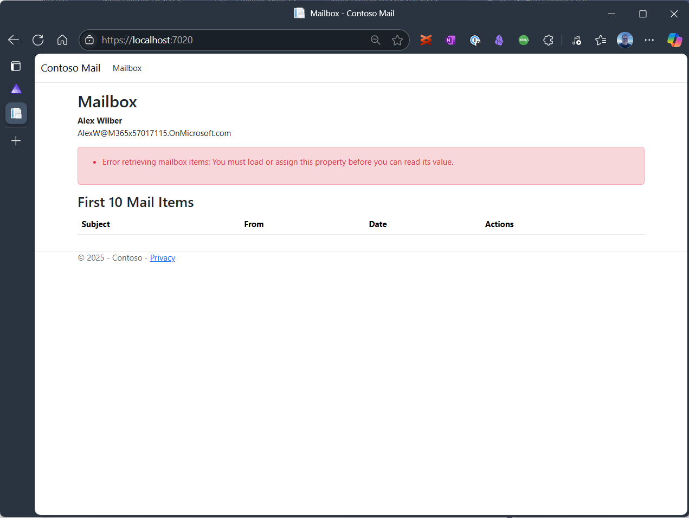
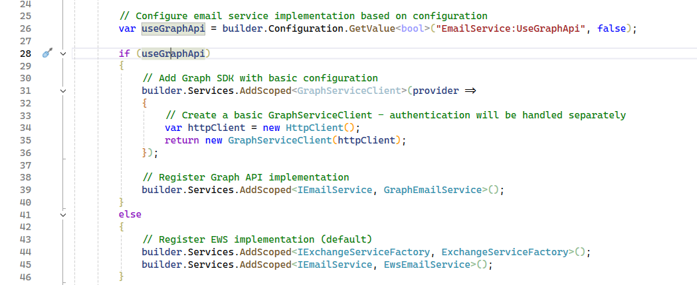
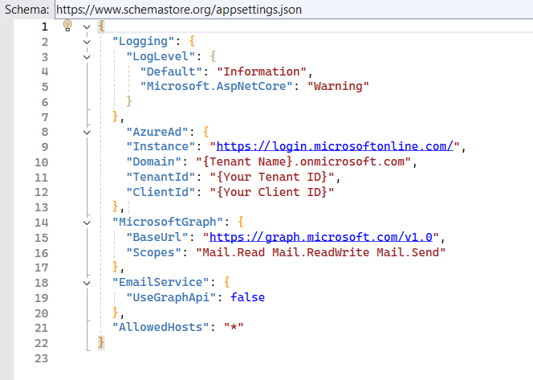
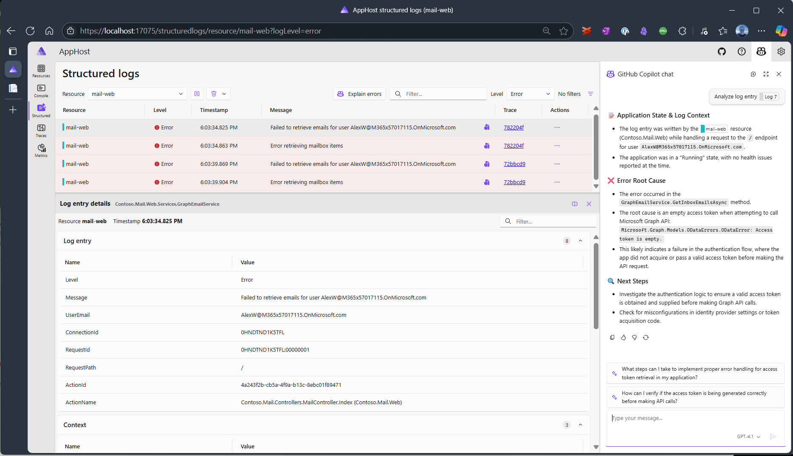
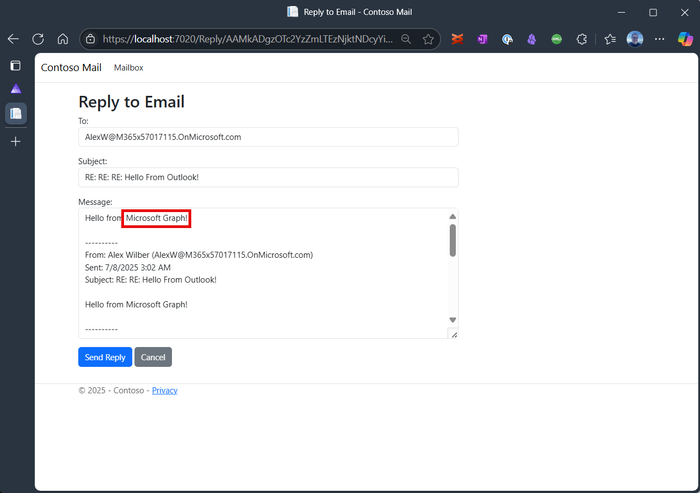

# 04 - Refactor

## Overview

The solution in this folder refactors the code to separate concerns between web request processing, business logic and interaction between the application and the mail APIs. This is a key step in preparing the application for migration from EWS to Microsoft Graph API.

## Step-by-Step Guide

### Refactoring the MailController

The mail controller currently combines multiple responsibilities, including handling HTTP requests and creating the view rendering, processing business logic, and interacting with the EWS API with the ultimate goal of making the mail logic implementation interchangeable between EWS and Graph API.

GitHub Copilot can help with this task as well.

Let's start the process by opening the following files in the IDE:

- `Contoso.Mail.Web/MailController.cs`
- `Contoso.Mail.Web/Program.cs`
- `AppHost/AppHost.cs`

Then run the folllowing prompt:

```prompt
Create a service layer that separates the business logic and email handling into their own service classes. Use interfaces and dependency injection to make the implementations swappable.
```

Copilot created three services to separate concerns between request handling, authentication, email logic and email service interactions.


It also automatically fixed up the unit tests and added several new ones to cover the additional services. As a positive side effect, this step improves the code coverage of the `MailController` drastically.

It also updated Program.cs with code to utilize dependency injection to configure the services to be used at runtime.

The tests pass and a quick run of the application shows that the functionality is still intact.

### Implement IEmailService with Graph API

Now that the application is refactored, we can implement the `IEmailService` interface to use Microsoft Graph API instead of EWS.

Close all the tabs that were open for the refactoring step and open `IEmailService.cs` in the `Contoso.Mail.Web/Services` folder.

#### Add Graph API Best Practices to copilot-instructions.md

To ensure that the implementation follows best practices for using Microsoft Graph API, we will add a section to the `.github/copilot-instructions.md` file in the root folder of the solution.

Open a new Copilot chat and use the following prompt to add the best practices:

```prompt
Add Microsoft Graph API best practices to copilot-instructions.md
```

This will add abest practices for interacting with Microsoft Graph API including topics like handling throttling, batching requests, and using the SDK effectively.

#### Implement IEmailService with Graph API

Open a new Copilot conversation and use the following prompt to start the Graph API implementation:

```prompt
Implement IEmailService using Graph API
```

Copilot will generate the code to implement the `IEmailService` interface using Microsoft Graph API. It will add and restore the necessary NuGet packages. It will also update the unit tests to cover the new implementation.

In my case, Copilot added a model for EmailMessage to abstract the EWS type representing an Email but failed to fix up all references and resolve the ambiguity. Prompting Copilot to `"Use Contoso.Mail.Models.EmailMessage as the common model for all implementations of IEmailService"` resolved the issue.

Next are the tests. Copilot might create additional tests to cover the Graph API implementation. In my case, there were some build issues inititally that Copilot was able to resolve on its own but several tests were failing when Copilot thought it was done. I prompted Copilot to `"Fix the unit tests for the Graph API implementation of IEmailService"` and it was able to fix the majority of tests. At the end of the processing of that prompt Copilot had created 82 tests with 4 failing. To get them passing I went through each one and asked Copilot to explain and fix them.

#### Making it Work again

Sometimes having passing unit tests doesn't mean the application works. That was the case for me. When I ran the application, I got a runtime errors when trying to retrieve the list of emails from Graph API.



To resolve this, I switched over to the Aspire view.


Drilling down another level to the structured logs, Aspire showed me two different errors. One was MSAL related, the other was a custom error about retrieving mailbox items.

Copilot can help here, too. The dashboard has a Copilot button in the top right corner. Clicking it opens a Copilot chat that is context aware and can help with the current issue or run a analysis of recent logs.

Opening up the MSAL error and asking Copilot to investigate yields a useful answer. Copilot indicates that the user object was null and because of that it wasn't possible to retrieve the access token silently. The app behaved as expected and redirected to the login page. This does not seem like the issue that is preventing the application from retrieving emails, but we can return to it and handle the exception and and redirect to the login page without logging an error immediately to reduce false negatives.

Moving on the the second error, I open a new Copilot chat which offers `Investigate Log 102` as a suggested prompt. The Copilot investigation indicates that the error is caused by accessing a property that hasn't been retrieved by EWS (rather than Graph API). That may be an indication that we are not actually using Graph API, yet. Let's check Program.cs to see if GraphApi is actually loaded during startup.

As it turns out, Copilot executed an instruction from `copilot-instructions.md` and implemented a configuration switch that allows an administrator to toggle between the EWS and Graph API implementations of `IEmailService`. 



Looking at the `appsettings.json` file, we can confirm that the `UseGraphApi` setting is set to `false`.



Let's change the setting to `true` and restart the application.

However, the fact that the selected EWS implementation is not working correctly is an issue that we need to address later. For now, let's focus on testing the Graph API implementation.

The error is different now, indicating that no access token was provided to the Graph API call to retrieve the emails. The login appears to have worked because the user name is displayed in the log entry.



With that information, let's take a look at the `GraphApiEmailService` implementation. The `GraphServiceClient` is injected into the service and can be used to retrieve the access token, it is not configured correctly to retrieve access tokens for the correct scopes to access the endpoints for retrieving mail items and sending email. Copilot correctly identified the issue and update the code. In my environment, I saw a runtime error trying to load one of the Microsoft.Identity assemblies.

To fix that I did not use Copilot but rather updated the NuGet package containing the reference to the DLL that could not be loaded: `Microsoft.Identity.Web` and that solved the problem.

I can now open the application and it will retrieve the emails for the authenticated user:


I can also reply to an email and the application populates the response with "Hello from Graph API" as part of the body of the email.



An sending the email works as expected, too.

All that remains now to complete the migration is to remove all references to EWS and the EWS implementation of `IEmailService`.

### Remove EWS References


## Next Steps

1. Refactor application for modularity
1. Implement EWS components with Graph API
