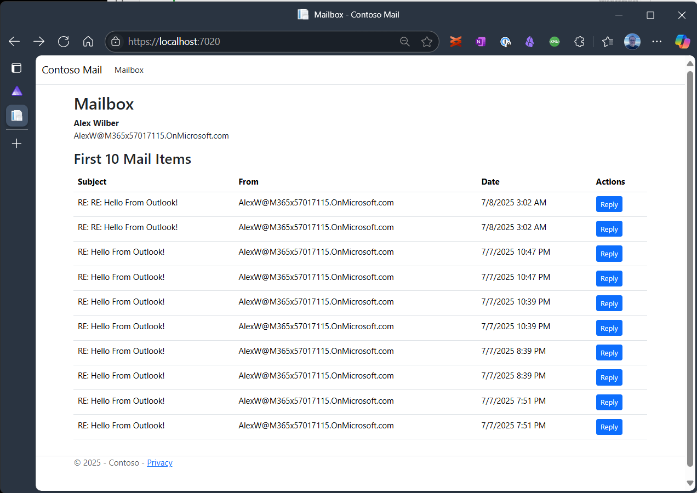
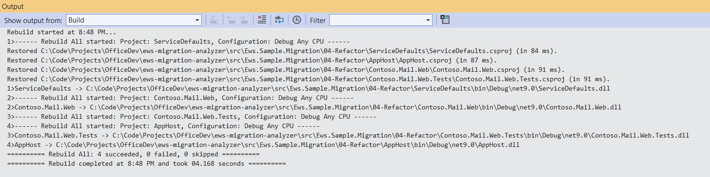

# 04 - Refactor

## Overview

We have taken several steps to improve our understanding of the application and created a solid foundation on which we can build and make changes with confidence.

The solution in this folder refactors the code to separate concerns between web request processing, business logic and interaction between the application and the mail APIs. This is a key step in preparing the application for migration from EWS to Microsoft Graph API.

## Step-by-Step Guide

### Refactoring `MailController`

The mail controller currently combines multiple responsibilities, including handling HTTP requests and creating the view rendering, processing business logic, and interacting with the EWS API with the ultimate goal of making the mail logic implementation interchangeable between EWS and Graph API.

GitHub Copilot can help with this task as well.

Let's start the process by opening the following files in the IDE:

- `Contoso.Mail.Web/MailController.cs`
- `Contoso.Mail.Web/Program.cs`
- `AppHost/AppHost.cs`

Then run the following prompt:

```prompt
Create a service layer that separates the business logic and email handling into their own service classes. Use interfaces and dependency injection to make the implementations swappable.
```

Copilot created three services to separate concerns between request handling, authentication, email logic and email service interactions.


It also automatically fixed up the unit tests and added several new ones to cover the additional services. As a positive side effect, this step improves the code coverage of the `MailController` drastically.

It also updated `Program.cs` with code to utilize dependency injection to configure the services to be used at runtime.

The tests pass and a quick run of the application shows that the functionality is still intact.

### Implement `IEmailService` with Graph API

Now that the application is refactored, we can implement the `IEmailService` interface to use Microsoft Graph API instead of EWS.

Close all the tabs that were open for the refactoring step and open `IEmailService.cs` in the `Contoso.Mail.Web/Services` folder.

#### Add Graph API Best Practices to Context

To ensure that the implementation follows best practices for using Microsoft Graph API, we will add a section to the `.github/copilot-instructions.md` file in the root folder of the solution.

Open a new Copilot chat and use the following prompt to add the best practices:

```prompt
Add Microsoft Graph API best practices to copilot-instructions.md
```

This will add best practices for interacting with Microsoft Graph API including topics like handling throttling, batching requests, and using the SDK effectively.

#### Implement `IEmailService` with Graph API

Open a new Copilot conversation and use the following prompt to start the Graph API implementation:

```prompt
Implement IEmailService using Graph API
```

Copilot will generate the code to implement the `IEmailService` interface using Microsoft Graph API. It will add and restore the necessary NuGet packages. It will also update the unit tests to cover the new implementation.

In my case, Copilot added a model for `EmailMessage` to abstract the EWS type representing an Email but failed to fix up all references and resolve the ambiguity. Prompting Copilot to `"Use Contoso.Mail.Models.EmailMessage as the common model for all implementations of IEmailService"` resolved the issue.

Next are the tests. Copilot might create additional tests to cover the Graph API implementation. In my case, there were some build issues initially that Copilot was able to resolve on its own but several tests were failing when Copilot thought it was done. I prompted Copilot to `"Fix the unit tests for the Graph API implementation of IEmailService"`, and it was able to fix the majority of tests in one shot. At the end of the processing of that prompt Copilot had created 82 tests with 4 failing. To get them passing I went through each one and asked Copilot to explain and fix them.

#### Making it Work again

Sometimes having passing unit tests doesn't mean the application works. That was the case for me. When I ran the application, I received runtime errors when trying to retrieve the list of emails from Graph API.


To resolve this, I switched over to the Aspire view.


Drilling down another level to the structured logs, Aspire showed me two different errors. One was MSAL related, the other was a custom error about retrieving mailbox items.

Copilot can help here, too. The dashboard has a Copilot button in the top right corner. Clicking it opens a Copilot chat that is context aware and can help with the current issue or run a analysis of recent logs.

Opening up the MSAL error and asking Copilot to investigate yields a useful answer. Copilot indicates that the user object was null and because of that it wasn't possible to retrieve the access token silently. The app behaved as expected and redirected to the login page. This does not seem like the issue that is preventing the application from retrieving emails, but we can return to it and handle the exception and redirect to the login page without logging an error immediately to reduce false negatives.

Moving on the second error, I open a new Copilot chat which offers `Investigate Log` as a suggested prompt. The Copilot investigation indicates that the error is caused by accessing a property that hasn't been retrieved by EWS (rather than Graph API). That may be an indication that we are not actually using Graph API, yet. Let's check `Program.cs` to see if Graph API is actually loaded during startup.

As it turns out, Copilot executed an instruction from `copilot-instructions.md` and implemented a configuration switch that allows an administrator to toggle between the EWS and Graph API implementations of `IEmailService`.

This is a rudimentary implementation of a feature toggle that can be elaborated for applications with more granular use cases that require alternative implementations. This is a useful pattern for A/B testing and gradual rollouts of new features. In the case of EWS migrations it is useful for cases where some but not all requirements that were supported by EWS are available in Graph API. It allows us to migrate the capabilities that are supported by Graph API and keep the EWS implementation around for the parts that are not yet supported.

> **Pro Tip:** Use Feature Toggles to migrate supported features to Graph API while keeping the EWS implementation for unsupported features.


Looking at the `appsettings.json` file, we can confirm that the `UseGraphApi` setting is set to `false`.


Let's change the setting to `true` and restart the application.

However, the fact that the selected EWS implementation is not working correctly is an issue that we may want to address later if the goal is to keep the EWS implementation alive. For now, let's focus on testing the Graph API implementation.

The error is different now, indicating that no access token was provided to the Graph API call to retrieve the emails. The login appears to have worked because the username is displayed in the log entry.


With that information, let's take a look at the `GraphApiEmailService` implementation. The `GraphServiceClient` is injected into the service and can be used to retrieve the access token, it is not configured correctly to retrieve access tokens for the correct scopes to access the endpoints for retrieving mail items and sending email. Copilot correctly identified the issue and update the code. In my environment, I saw a runtime error trying to load one of the `Microsoft.Identity` assemblies.

To fix that I did not use Copilot but rather updated the NuGet package containing the reference to the DLL that could not be loaded: `Microsoft.Identity.Web` and that solved the problem.

I can now open the application, and it will retrieve the emails for the authenticated user:



I can also reply to an email and the application populates the response with "Hello from Graph API" as part of the body of the email.


Sending the email works as expected, too.

All that remains now to complete the migration is to remove all references to EWS and the EWS implementation of `IEmailService`.

### Remove EWS References

Technically, the solution meets the requirements for deprecation of EWS now. All EWS calls are disabled using the `UseGraphAPI` configuration setting. It may make sense to keep the EWS implementation around if the application also needs to connect to on-premises Exchange servers where Graph API is not available and EWS will continue to be a great option.

For the purposes of this sample, we will remove the EWS implementation and all references to EWS. To accomplish that we can again call on Copilot with the prompt:

```prompt
Remove all references to EWS including logic, tests and NuGet packages specific to EWS
```

Because we have separated the concerns of the web controller from the Email related logic, removing EWS logic can be accomplished by deleting files, e.g. `EwsEmailService.cs` and `ExchangeServiceFactory.cs` removing the EWS NuGet package and deleting the test classes implementing EWS specific tests without affecting the rest of the application. The changes to `Program.cs` are also well contained in the EWS branch of the feature toggle responding to the `UseGraphApi` setting.

Copilot will even clean up the `copilot-instructions.md` file and several README.md files to EWS specific text.


When Copilot was done, in my case, all that was left to do was remove an unused using statement for `Microsoft.Exchange.*` and several `catch` blocks for `ServiceResponseExceptions` that are EWS specific and could have been wrapped in the `EwsEmailService` implementation to avoid leaking EWS specific exceptions into the web controller.

The number of tests shrank back from 82 to 62, all passing and the app continued to work using Graph API.

Copilot also removed the `Ews.Analyzer` package from the solution. To double-check that there are no EWS references left, we can add the analyzer back and rebuild the solution. The analyzer should not report any EWS references.



### Conclusion

We started with an application that was tightly coupled to EWS without tests and documentation. We shored up the foundation by documenting the code, adding tests and refactoring the code to separate concerns without writing much code by hand.

After stabilizing the application, we implemented the Graph API equivalent version of the email service. Copilot wrote most of the code based on common sense prompts while updating and adding tests and documenting the work it was doing. We maintained code quality throughout with 0 errors, warnings and messages from code quality analyzers.

.NET Aspire in conjunction with Copilot helped us quickly analyze logs and troubleshoot authentication issues. Copilot was able to explain the issue in plain language and fix the code.

In the end we had flexibility in whether we wanted to keep the EWS implementation around for use with on-premises Exchange or while we wait for feature gaps in Graph API to be filled. We elected to remove it completely.

Copilot was able to remove all references to EWS in one shot except for a couple of using statements and EWS specific Exceptions that were easily removed by hand.

I hope you can see that Copilot is a great tool reducing technical debt, improving code quality and documenting the status quo as well as implementing new features based on the established coding style and technology specific best practices.

A chore like migrating EWS applications to Graph can be a great learning opportunity to dig deeper into AI developer tools while obliterating technical debt.

If you run into any issues or have ideas for extending the tools and methodologies presented in this migration series, leave us a comment or create a [GitHub Issue](https://github.com/OfficeDev/ews-migration-analyzer/issues)