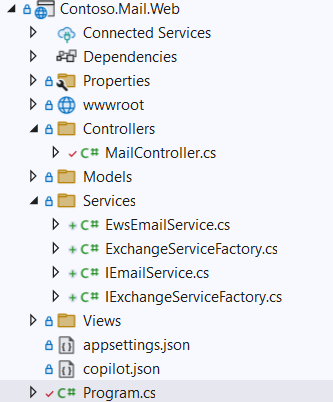

# 04 - Refactor

## Overview

The solution in this folder refactors the code to separate concerns between web request processing, business logic and interaction between the application and the mail APIs. This is a key step in preparing the application for migration from EWS to Microsoft Graph API.

## Step-by-Step Guide

### Refactoring the MailController

The mail controller currently combines multiple responsibilities, including handling HTTP requests and creating the view rendering, processing business logic, and interacting with the EWS API with the ultimate goal of making the mail logic implementation interchangeable between EWS and Graph API.

GitHub Copilot can help with this task as well.

Let's start the process by opening the following files in the IDE:

- `Contoso.Mail.Web/MailController.cs`
- `Contoso.Mail.Web/Program.cs`
- `AppHost/AppHost.cs`

Then run the folllowing prompt:

```prompt
Create a service layer that separates the business logic and email handling into their own service classes. Use interfaces and dependency injection to make the implementations swappable.
```

Copilot created three services to separate concerns between request handling, authentication, email logic and email service interactions.



It also automatically fixed up the unit tests and added several new ones to cover the additional services. As a positive side effect, this step improves the code coverage of the `MailController` drastically.

It also updated Program.cs with code to utilize dependency injection to configure the services to be used at runtime.

The tests pass and a quick run of the application shows that the functionality is still intact.

### Implement IEmailService with Graph API

Now that the application is refactored, we can implement the `IEmailService` interface to use Microsoft Graph API instead of EWS.

Close all the tabs that were open for the refactoring step and open `IEmailService.cs` in the `Contoso.Mail.Web/Services` folder.

#### Add Graph API Best Practices to copilot-instructions.md

To ensure that the implementation follows best practices for using Microsoft Graph API, we will add a section to the `.github/copilot-instructions.md` file in the root folder of the solution.

Open a new Copilot chat and use the following prompt to add the best practices:

```prompt
Add Microsoft Graph API best practices to copilot-instructions.md
```

This will add abest practices for interacting with Microsoft Graph API including topics like handling throttling, batching requests, and using the SDK effectively.

#### Implement IEmailService with Graph API

Open a new Copilot conversation and use the following prompt to start the Graph API implementation:

```prompt
Implement IEmailService using Graph API
```

Copilot will generate the code to implement the `IEmailService` interface using Microsoft Graph API. It will add and restore the necessary NuGet packages. It will also update the unit tests to cover the new implementation.

In my case, Copilot added a model for EmailMessage to abstract the EWS type representing an Email but failed to fix up all references and resolve the ambiguity. Prompting Copilot to `"Use Contoso.Mail.Models.EmailMessage as the common model for all implementations of IEmailService"` resolved the issue.

Next are the tests. Copilot might create additional tests to cover the Graph API implementation. In my case, there were some build issues inititally that Copilot was able to resolve on its own but several tests were failing when Copilot thought it was done. I prompted Copilot to `"Fix the unit tests for the Graph API implementation of IEmailService"` and it was able to fix the majority of tests. At the end of the processing of that prompt Copilot had created 82 tests with 4 failing. To get them passing I went through each one and asked Copilot to explain and fix them.

## Next Steps

1. Refactor application for modularity
1. Implement EWS components with Graph API
